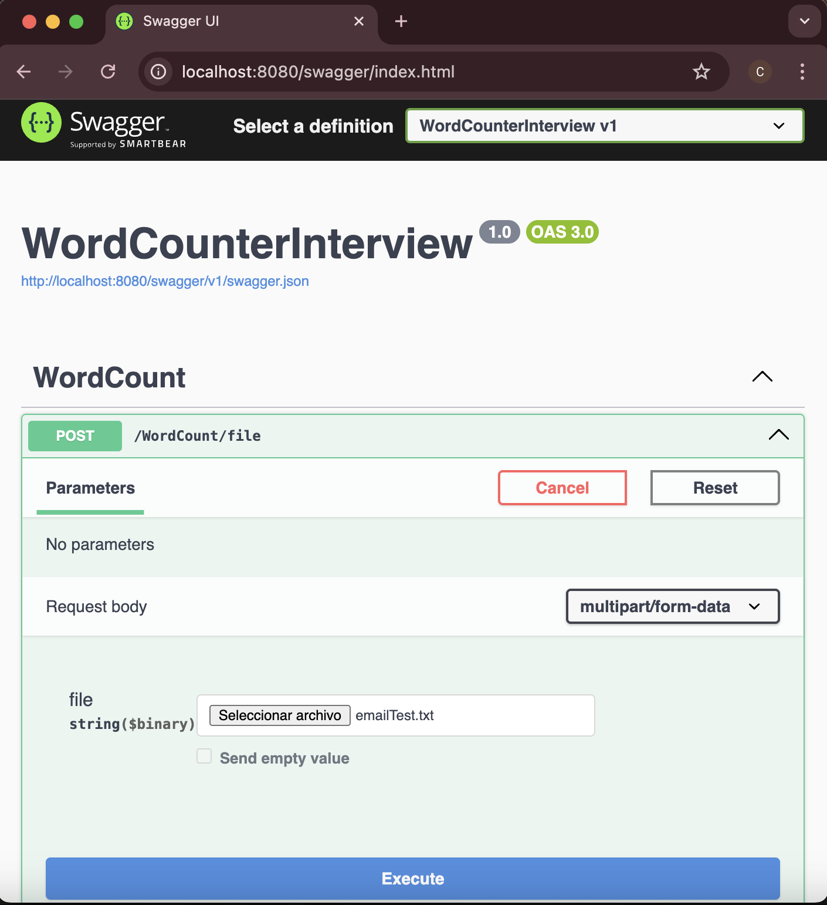

# Word Counter API

## Overview
This project implements a **Word Counter API** in **.NET 9 (C#)**, designed as a preparation for a technical interview.  

While the problem statement was very simple:

> *"Given a text file, count the occurrence of each unique word in the file."*

I approached the solution as if it were part of a **real enterprise backend system**, applying:
- **SOLID principles**
- **Clean architecture patterns** (controllers, services, models)
- **Dependency Injection**
- **Logging and error handling**
- **Unit and integration testing**
- **OpenAPI/Swagger documentation**

The goal was not only to solve the exercise, but to demonstrate my ability to design **enterprise-grade code**.

---

## Assumptions and Design Decisions
Since the statement was underspecified, I made the following assumptions:

1. **API-based Solution**  
   Instead of a console app, I built a **REST API** to demonstrate backend development skills.

2. **File Upload**  
   - Input is received as a `.txt` file (via `multipart/form-data`).  
   - Other extensions (e.g. `.png`, `.pdf`) are rejected.  
   - Max file size: **5 MB** (configurable).

3. **Text Normalization**  
   - All words are lowercased using [`ToLowerInvariant`](https://learn.microsoft.com/en-us/dotnet/api/system.string.tolowerinvariant?view=net-9.0).  
   - Only **Unicode letters** are allowed (`\p{L}`), everything else (numbers, punctuation) is removed.  
   - Multiple spaces, tabs, and line breaks are collapsed.

4. **Encoding Validation**  
   - Only **UTF-8 encoded files** are accepted (Unless compatible).  
   - Files with invalid encodings trigger a `400 Bad Request`.

5. **Error Handling**  
   - Proper `400 Bad Request` responses with descriptive error messages.  
   - Logging of exceptions with `ILogger`.

6. **Testing**  
   - **Unit Tests** for the word counting service.  
   - **Integration Tests** for the API endpoints using `WebApplicationFactory`.

--

## Results

The API was deployed in a Docker container and tested through the Swagger UI:



Using the example given in the statement

```text
"Go do that thing that you do so well"
```

the POST /WordCount/file endpoint returns the following result:

```javascript
[
  {
    "word": "go",
    "count": 1
  },
  {
    "word": "do",
    "count": 2
  },
  {
    "word": "that",
    "count": 2
  },
  {
    "word": "thing",
    "count": 1
  },
  {
    "word": "you",
    "count": 1
  },
  {
    "word": "so",
    "count": 1
  },
  {
    "word": "well",
    "count": 1
  }
]
```
